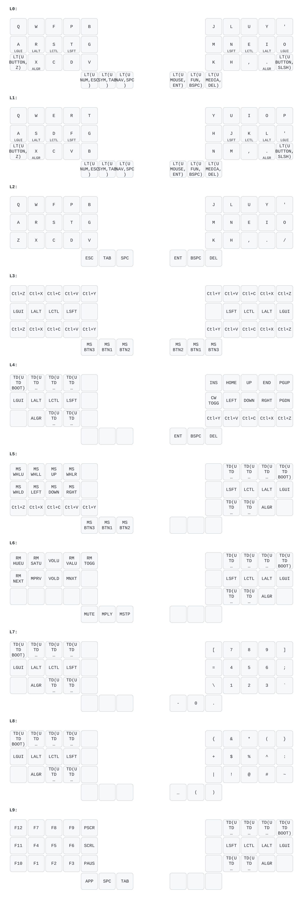

# barediver keymap — generated diagrams

**Auto-generated. Do not edit by hand** — `keymap.c` is the source of truth.



## Regenerate

VS Code: `Ctrl+Shift+P` → **Tasks: Run Task** → **QMK: Draw keymap diagram (skeletyl/barediver)**

Or from this keymap directory:

```sh
qmk c2json -kb bastardkb/skeletyl/promicro -km barediver -o docs/barediver.json
keymap parse -q docs/barediver.json > docs/barediver.keymap.yaml
keymap draw docs/barediver.keymap.yaml > docs/barediver.svg
rsvg-convert -z 1.5 -b white docs/barediver.svg -o docs/barediver.png
```

## Files

| File | What it is |
|------|------------|
| `barediver.json` | `qmk c2json` export (QMK Configurator format) |
| `barediver.keymap.yaml` | keymap-drawer input (hand-editable for nicer labels via a config + `-c`) |
| `barediver.svg` / `barediver.png` | rendered layer diagram |

## Caveats

- Uses the **`promicro`** target: keymap-drawer doesn't recognize the `splinky` variant, but `LAYOUT_split_3x5_3` is identical so positioning is correct. (Firmware still builds/flashes as `splinky`.)
- `c2json` captures all layers, home-row mods, and layer-taps — but **not** combos, `key_overrides`, or `process_record_user` logic. The diagram is the layer map, not a full behavioral mirror.

Tooling: [keymap-drawer](https://github.com/caksoylar/keymap-drawer) (`pipx install keymap-drawer`), `rsvg-convert` (librsvg).
